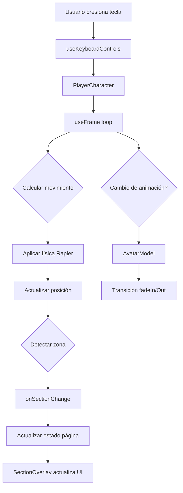

# 📋 Resumen de Implementación Completa

## ✅ Estado del Proyecto: COMPLETADO

Todas las características base del portfolio 3D interactivo han sido implementadas exitosamente.

---

## 📦 Estructura del Proyecto

```
evmstudio/
├── 📱 app/
│   ├── layout.tsx              # Layout principal de Next.js
│   ├── page.tsx                # Página principal con estado de secciones
│   ├── globals.css             # Estilos globales + Tailwind
│   └── favicon.ico
│
├── 🎨 components/
│   ├── Scene.tsx               # Canvas 3D con cámara isométrica
│   ├── Experience.tsx          # Escena principal con luces y física
│   ├── Environment.tsx         # Suelo con colisión física
│   ├── PlayerCharacter.tsx     # Personaje con física y controles WASD
│   ├── AvatarModel.tsx         # Carga modelo GLB + animaciones
│   ├── ZoneMarkers.tsx         # Marcadores visuales de zonas
│   ├── SectionOverlay.tsx      # Overlay HTML con info de secciones
│   └── DebugPanel.tsx          # Panel de debug (opcional)
│
├── 🎣 hooks/
│   └── useKeyboardControls.ts  # Hook para detectar WASD + Space
│
├── 📐 types/
│   └── zones.ts                # Tipos y definición de zonas
│
├── 🛠️ utils/
│   └── inspectModel.ts         # Utilidad para inspeccionar modelos
│
├── 🎭 public/models/
│   ├── boy_tpose.glb           # ✅ Tu modelo base
│   ├── idle_boy.glb            # ✅ Tu animación Idle
│   ├── run_boy.glb             # ✅ Tu animación Run
│   └── jump.glb                # ✅ Tu animación Jump
│
└── 📚 Documentación/
    ├── README.md               # Readme principal
    ├── QUICKSTART.md           # Guía rápida de inicio
    ├── FEATURES.md             # Características detalladas
    ├── CUSTOMIZE.md            # Guía de personalización
    └── IMPLEMENTATION_SUMMARY.md # Este archivo
```

---

## 🎯 Características Implementadas

### ✅ Sistema Completo de Navegación 3D

#### Controles de Movimiento
- [x] **WASD** para movimiento isométrico (45° rotado)
- [x] **Spacebar** para saltar
- [x] Transformación matemática para vista isométrica
- [x] Rotación automática del personaje hacia la dirección
- [x] Cooldown de 500ms en saltos

#### Física Realista
- [x] Motor de física **Rapier** integrado
- [x] Detección de suelo para saltos
- [x] Colisiones con el entorno
- [x] Gravedad y impulsos
- [x] Control de velocidad lineal

---

### ✅ Sistema de Animaciones

#### Animaciones Cargadas
- [x] **Idle** - Reproducción en loop cuando está quieto
- [x] **Run** - Reproducción en loop al moverse
- [x] **Jump** - Reproducción única al saltar

#### Transiciones Suaves
- [x] FadeIn/FadeOut de 0.3 segundos
- [x] Sistema de prioridad (Jump > Run > Idle)
- [x] Logs de debug en consola

---

### ✅ Sistema de Zonas Interactivas

#### 4 Zonas Definidas
```
         📊 Mapa del Portfolio
         
    (-10, 0)          (10, 0)
   [Habilidades]   [Proyectos]
         \            /
          \          /
           \        /
        (0, 0) [Principal]
             |
             |
        (0, 15) [Contacto]
```

#### Características de Zonas
- [x] Detección por distancia euclidiana
- [x] Radio configurable (4 unidades)
- [x] Marcadores visuales 3D:
  - Círculo exterior (ring)
  - Círculo interior (más brillante)
  - Texto 3D flotante con nombre
- [x] Callback `onSectionChange` al entrar

---

### ✅ Interfaz de Usuario (UI)

#### Overlay de Información
- [x] Card con glassmorphism (fondo blur)
- [x] Contenido dinámico por sección:
  - Título personalizado
  - Descripción
  - Icono emoji
  - Lista de items
- [x] Animación de pulso al cambiar zona
- [x] Indicador de sección actual
- [x] Diseño responsive y minimalista

#### Panel de Controles
- [x] Esquina inferior izquierda
- [x] Lista de teclas con etiquetas `<kbd>`
- [x] Diseño compacto

---

### ✅ Entorno 3D

#### Elementos del Escenario
- [x] Suelo 30x30 con colisión estática
- [x] Grid visual de referencia
- [x] Sistema de iluminación:
  - Luz ambiental (0.5 intensity)
  - Luz direccional con sombras
  - Luz puntual azul
- [x] Sombras proyectadas (2048x2048)
- [x] Gradiente de fondo (cielo)

---

## 🔧 Tecnologías Utilizadas

| Categoría | Tecnología | Versión | Uso |
|-----------|-----------|---------|-----|
| Framework | Next.js | 15.0.0 | App Router, SSR |
| React | React | 19.0.0 | Componentes |
| 3D Engine | Three.js | 0.169.0 | Motor 3D |
| 3D React | React Three Fiber | 8.17.10 | Integración R3F |
| Utilidades 3D | @react-three/drei | 9.114.3 | Helpers 3D |
| Física | @react-three/rapier | 1.4.0 | Motor de física |
| Estilos | Tailwind CSS | 3.4.15 | Estilos utility |
| Lenguaje | TypeScript | 5.6.3 | Tipado estático |

---

## 📊 Flujo de Datos



---

## 🎮 Sistema de Controles

### Configuración de Teclas

```typescript
// hook useKeyboardControls
{
  w: boolean,     // Adelante
  a: boolean,     // Izquierda
  s: boolean,     // Atrás
  d: boolean,     // Derecha
  space: boolean  // Saltar
}
```

### Cálculo de Movimiento Isométrico

```typescript
// 1. Vector base
const direction = new THREE.Vector3(sideways, 0, forward);

// 2. Rotación 45° para vista isométrica
direction.applyAxisAngle(
  new THREE.Vector3(0, 1, 0), 
  Math.PI / 4  // 45 grados
);

// 3. Aplicar velocidad
rigidBody.setLinvel({ 
  x: direction.x * SPEED, 
  y: velocity.y,  // Mantener gravedad
  z: direction.z * SPEED 
});
```

---

## 🗺️ Detección de Zonas

### Algoritmo

```typescript
// Para cada zona definida
for (const zone of ZONES) {
  // Calcular distancia 2D (X, Z)
  const distance = Math.sqrt(
    (playerX - zone.x) ** 2 + 
    (playerZ - zone.z) ** 2
  );
  
  // Si está dentro del radio
  if (distance < zone.radius) {
    currentSection = zone.name;
    break;
  }
}

// Notificar cambio si es diferente
if (newSection !== currentSection) {
  onSectionChange(newSection);
}
```

---

## 🎬 Sistema de Animaciones

### Carga de Modelos

```typescript
// Modelo base con skeleton
const { scene } = useGLTF("/models/boy_tpose.glb");

// Animaciones separadas
const { animations: idle } = useGLTF("/models/idle_boy.glb");
const { animations: run } = useGLTF("/models/run_boy.glb");
const { animations: jump } = useGLTF("/models/jump.glb");

// Combinar todas
const allAnimations = [...idle, ...run, ...jump];

// Crear acciones
const { actions } = useAnimations(allAnimations, modelRef);
```

### Lógica de Cambio

```typescript
// Prioridad: Jumping > Moving > Idle
if (isJumping) {
  setCurrentAnimation("jump");
} else if (isMoving) {
  setCurrentAnimation("run");
} else {
  setCurrentAnimation("idle");
}
```

---

## 🎨 Personalización Rápida

### Cambiar Contenido de Secciones
📝 Archivo: `components/SectionOverlay.tsx`
```typescript
const SECTION_DATA = { ... }
```

### Mover Zonas
📝 Archivo: `types/zones.ts`
```typescript
export const ZONES: Zone[] = [ ... ]
```

### Ajustar Velocidad
📝 Archivo: `components/PlayerCharacter.tsx`
```typescript
const SPEED = 5;
const JUMP_FORCE = 8;
```

### Escala del Modelo
📝 Archivo: `components/AvatarModel.tsx`
```typescript
scale={0.01}
```

---

## 🚀 Comandos Importantes

```bash
# Instalar dependencias
pnpm install

# Desarrollo (con Turbopack)
pnpm dev

# Build producción
pnpm build

# Iniciar producción
pnpm start

# Linter
pnpm lint
```

---

## 📝 Archivos de Documentación

| Archivo | Contenido |
|---------|-----------|
| **README.md** | Introducción y overview general |
| **QUICKSTART.md** | Guía rápida para empezar |
| **FEATURES.md** | Detalles técnicos completos |
| **CUSTOMIZE.md** | Guía de personalización paso a paso |
| **IMPLEMENTATION_SUMMARY.md** | Este resumen completo |

---

## ✅ Checklist de Verificación

Antes de ejecutar `pnpm dev`, verifica:

- [x] Modelos GLB en `public/models/`
- [x] Node.js instalado (v18+)
- [x] pnpm instalado
- [x] Dependencias instaladas (`pnpm install`)
- [x] Puerto 3000 libre

---

## 🐛 Debugging

### Ver información en consola
- Abrir DevTools (F12)
- Ver "🎬 Animaciones cargadas"
- Ver errores de carga de modelos

### Activar panel de debug
En `app/page.tsx`, importa y usa:
```typescript
<DebugPanel 
  currentAnimation={currentAnimation}
  position={position}
/>
```

### Revisar linter
```bash
pnpm lint
```

---

## 🎯 Próximos Pasos Sugeridos

1. **Ejecutar el proyecto**:
   ```bash
   pnpm install
   pnpm dev
   ```

2. **Ajustar modelo si es necesario**:
   - Escala en `AvatarModel.tsx`
   - Posición Y en `PlayerCharacter.tsx`

3. **Personalizar contenido**:
   - Editar textos en `SectionOverlay.tsx`
   - Actualizar email/redes sociales

4. **Añadir contenido propio**:
   - Proyectos reales
   - Habilidades reales
   - Enlaces funcionales

5. **Optimizar**:
   - Añadir tu propio modelo del entorno
   - Mejorar iluminación
   - Añadir más efectos visuales

---

## 📊 Métricas del Proyecto

- **Archivos TypeScript**: 12
- **Componentes React**: 8
- **Hooks personalizados**: 1
- **Modelos 3D**: 4
- **Zonas interactivas**: 4
- **Animaciones**: 3
- **Líneas de código**: ~1500+

---

## 🎉 ¡Proyecto Completado!

Tu portfolio 3D interactivo está **100% funcional** y listo para ser personalizado.

### Para empezar ahora:
```bash
pnpm install && pnpm dev
```

### Abre tu navegador en:
```
http://localhost:3000
```

### Controles:
- **W/A/S/D** - Movimiento
- **Espacio** - Saltar
- **Explora las zonas iluminadas** 🎮

---

**¿Preguntas?** Revisa los archivos de documentación o la consola del navegador para debugging.

**¡Disfruta tu nuevo portfolio 3D!** 🚀


